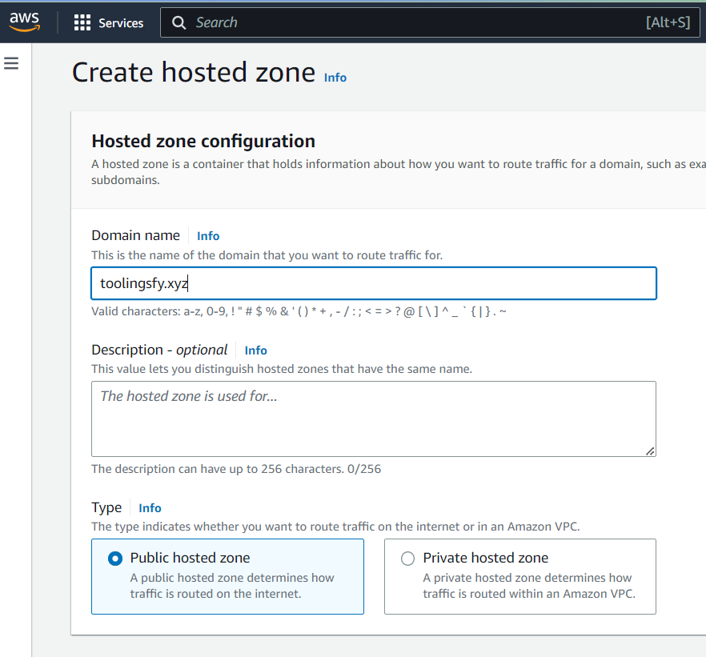
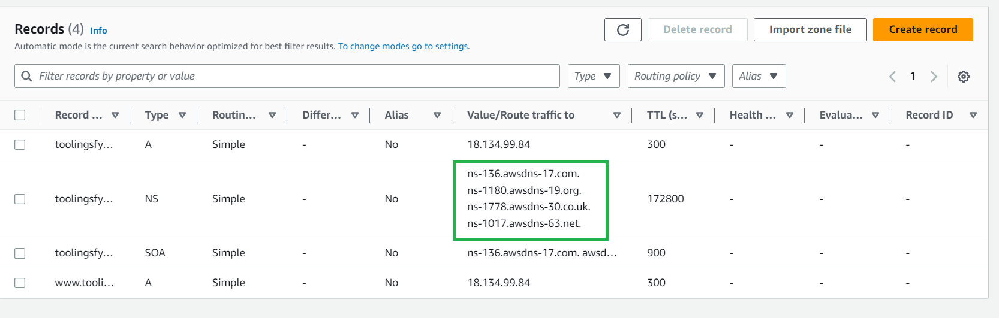
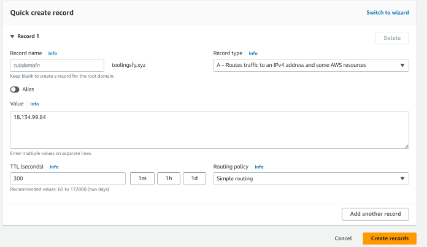
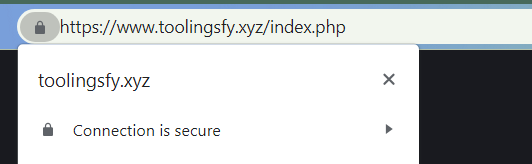
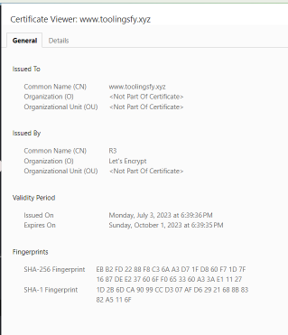

# LOAD BALANCER SOLUTION WITH NGINX AND SSL/TLS

Scope: to configure Nginx load balancer and secured connection using SSL/TLS 

## CONFIGURE LOAD BALANCER

1. Create an EC2 instance of Ubuntu 22.04 LTS to host Nginx load balancer 

    - open TCP port 80 for HTTP connection
    - open TCP port 443 for secured HTTPS connection

2. Open `/etc/hosts` and add entries for your web servers using an alias and private  IP address like so `<private_ip> Web2`

3. Update Ubuntu and install Nginx

    ```
    sudo apt update
    sudo apt install nginx
    ```

4. Run `sudo vi /etc/nginx/nginx.conf` and configure Nginx load balancer to point traffic to your web servers:

    ```
    #insert following configuration into http section

    upstream myproject {
        server Web1 weight=5;
        server Web2 weight=5;
    }

    server {
        listen 80;
        server_name www.domain.com;
        location / {
        proxy_pass http://myproject;
        }
    }

    #comment out this line
    #   include /etc/nginx/sites-enabled/*;
    ```

5. Restart Nginx and check that it is running

    ```
    sudo systemctl restart nginx
    sudo systemctl status nginx
    ```

6. Register a new domain name for your website - you can use [Namecheap.com](https://www.namecheap.com/)

7. You can [assign an Elastic IP address to your instance](https://docs.aws.amazon.com/AWSEC2/latest/UserGuide/elastic-ip-addresses-eip.html) so that the IP address will not change after reboot - then [associate this Elastic IP address to your domain](https://medium.com/progress-on-ios-development/connecting-an-ec2-instance-with-a-godaddy-domain-e74ff190c233)

8. Open **Route 53** and create a Hosted zone using your domain name - set it to public

    

9. Add the nameservers from the hosted zone to your domain - simply copy each nameserver to the "nameservers" section for your domain

    

10. Create an A record using Elastic IP address - this will point traffic to your Nginx load balancer. 

    

Then check that you can reach your web servers using your domain `http://<your-domain-name.com>`

11. Update Nginx configuration file so that it can use your domain

    ```
    sudo vi /etc/nginx/nginx.conf

    # change this line  
    server_name www.domain.com

    # to this
    server_name www.<domain.com>
    ```

12. Install `certbot` and request an SSL certificate

    ```
    # check that snapd is running
    sudo systemctl status snapd

    # install certbot
    sudo snap install --classic certbot
    
    # request a certificate, follow the instructions on the screen
    sudo ln -s /snap/bin/certbot /usr/bin/certbot
    sudo certbot --nginx
    ```

13. Open your browser and check that you can access your web servers using secured connection: `https://<your-domain-name.com>`

    

    You can also view the certificate for your site

    

14. Set up a job to renew certificate automatically using crontab

    ```
    crontab -e

    # for example you cans set up a renewal to run every 12 hours so twice a day
    * */12 * * *   root /usr/bin/certbot renew > /dev/null 2>&1

    # you can test the renewal command with
    sudo certbot renew --dry-run
    ```


    

    