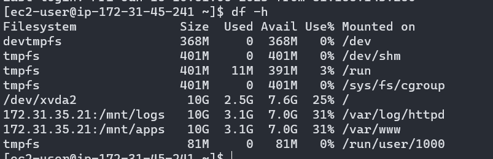
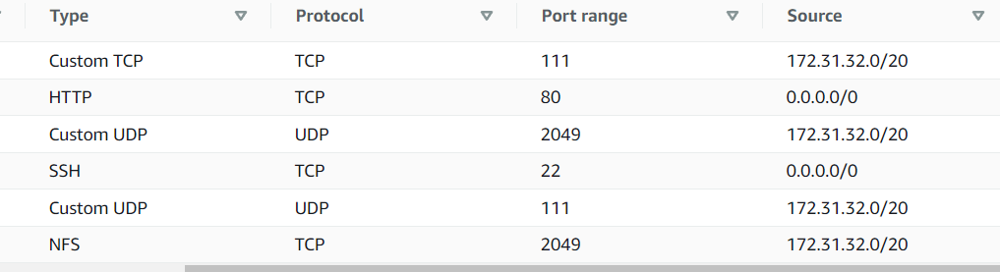
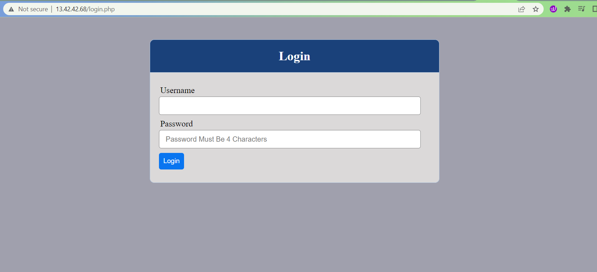
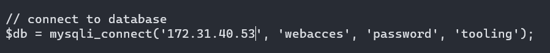
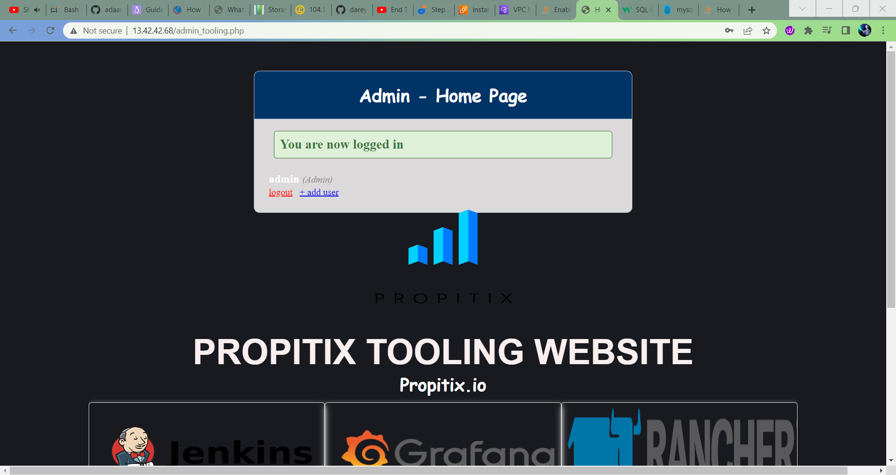

# DEVOPS TOOLING WEBSITE SOLUTION

Scope: to implement a tooling website solution using NFS server, Web Servers, and MySQL. This project is then continued in project 8

Spin up four EC2 instances and name them as follows:

- RHEL 8: web1
- RHEL 8: web2
- Ubuntu 20.04: database server
- RHEL 8: NFS server

## SET UP NFS SERVER

1. Add 3 EBS volumes of 10gb each to the NFS server. You will then have to partition the volumes and create 3 Logical volumes named **lv-opt lv-apps**, and **lv-logs**, formatted with **xfs** filesystem.


2. Create mount points for the LVs as follows:

    - **/mnt/apps** for lv-apps
    - **/mnt/logs** for lv-logs
    - **/mnt/opt** for lv-opt

    Mount disks using `sudo mount`


3. Run the following commands to install and configure NFS

    ```
    sudo yum -y update
    sudo yum install nfs-utils -y
    sudo systemctl start nfs-server.service
    sudo systemctl enable nfs-server.service # this ensures that NFS will automatically start after reboot
    sudo systemctl status nfs-server.service # check if nfs is running
    ```

4. Change permissions so that the Web servers can read, write and execute files on the NFS server

    ```
    sudo chown -R nobody: /mnt/apps
    sudo chown -R nobody: /mnt/logs
    sudo chown -R nobody: /mnt/opt

    sudo chmod -R 777 /mnt/apps
    sudo chmod -R 777 /mnt/logs
    sudo chmod -R 777 /mnt/opt

    sudo systemctl restart nfs-server.service
    ```

5. Configure access to NFS for Web servers within the same subnet cidr

    ```
    sudo vi /etc/exports

    /mnt/apps <Subnet-CIDR>(rw,sync,no_all_squash,no_root_squash)
    /mnt/logs <Subnet-CIDR>(rw,sync,no_all_squash,no_root_squash)
    /mnt/opt <Subnet-CIDR>(rw,sync,no_all_squash,no_root_squash)

    Esc + :wq!

    sudo exportfs -arv
    ```

6. Check which port is used by NFS with the command `rpcinfo -p | grep nfs
` then add an inbound rule for it in security groups


## SET UP DB SERVER

1. Install MySQL on the Ubuntu server and create a database named **tooling** 

2. Create a user with full privileges over the tooling database. Allow access for the user only from the webservers *subnet cdir*


## SET UP WEB SERVERS

Complete steps 1-4 on web1 and web2

1. Install NFS client with command `sudo yum install nfs-utils nfs4-acl-tools -y

2. Create a directory (/var/www) to store files served to users by Apache, and mount it to the NFS server's export for apps /mnt/apps

    ```
    sudo mkdir /var/www
    sudo mount -t nfs -o rw,nosuid <NFS-Server-Private-IP-Address>:/mnt/apps /var/www
    df -h # verify that NFS was mounted successfully
    ```

    

3. add a new entry in the fstab file so that the mount will persist after reboot

    ```
    sudo vi /etc/fstab
    <NFS-Server-Private-IP-Address>:/mnt/apps /var/www nfs defaults 0 0
    ```

4. Install Remi's repository, Apache and PHP

    ```
    sudo yum install httpd -y

    sudo dnf install https://dl.fedoraproject.org/pub/epel/epel-release-latest-8.noarch.rpm

    sudo dnf install dnf-utils http://rpms.remirepo.net/enterprise/remi-release-8.rpm

    sudo dnf module reset php

    sudo dnf module enable php:remi-7.4

    sudo dnf install php php-opcache php-gd php-curl php-mysqlnd

    sudo systemctl start php-fpm

    sudo systemctl enable php-fpm

    setsebool -P httpd_execmem 1
    ```

5.  In order for NFS server to be accessible from your client, you must also open following ports: TCP 111, UDP 111, UDP 2049, for extra security allow access only from subnet cdir

    

6. Go to /var/www and verify that the Apache html folder and files are present. You should see the same in /mnt/apps of the NFS server, if mounted correctly. You can try to create a new file `touch test.txt` from one server and check if the same file is accessible from other Web Server.

7. Mount the log folder for Apache (var/log/httpd) on one web server to the NFS server's export for logs /mnt/logs. Add a new entry in fstab file 

    ```
    sudo mount -t nfs -o rw,nosuid <NFS-Server-Private-IP-Address>:/mnt/logs /var/log/httpd
    sudo vi /etc/fstab
    <NFS-Server-Private-IP-Address>:/mnt/logs /var/log/httpd nfs defaults 0 0
    ```

8. Install git on the web server `sudo yum install git`

9. copy the tooling source code from [link](https://github.com/darey-io/tooling.git) with `git clone`

10. Copy the html folder from the repository to /var/www/html 

    `sudo cp -R /tooling/html/. /var/www/html`

11. Open TCP port 80 on the web server and try to access the tooling website from your browser using the web server's ip address  

    **note**  If you encounter 403 Error – check permissions to your /var/www/html folder and also disable SELinux `sudo setenforce 0`. 
    To make this change permanent – open following config file `sudo vi /etc/sysconfig/selinux` and set `SELINUX=disabled` then restart httpd.

    

12. Install MySQL server on the web server `sudo yum install mysql-server`

13. Open the /var/www/html/functions.php file and update it with the login details for the database 

    

14. Apply tooling-db.sql script to your database using this command `mysql -h <databse-private-ip> -u <db-username> -p tooling < tooling-db.sql`

15. Create in MySQL a new admin user with username: **myuser** and password: **password**

`INSERT INTO users VALUES ('2', ‘myuser’, ‘5f4dcc3b5aa765d61d8327deb882cf99’, ‘user@mail.com’, ‘admin’, ‘1’);`

16. make sure you can login into the tooling website with **myuser**

    
