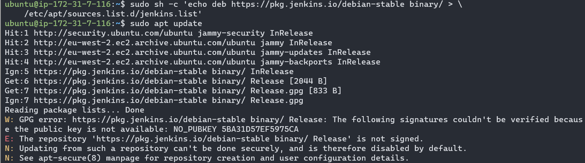
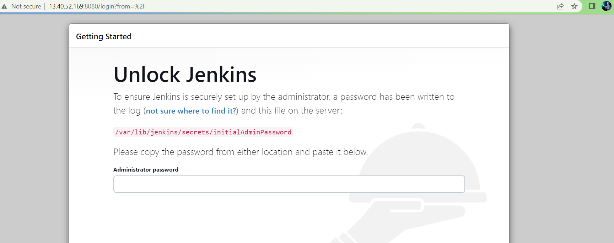
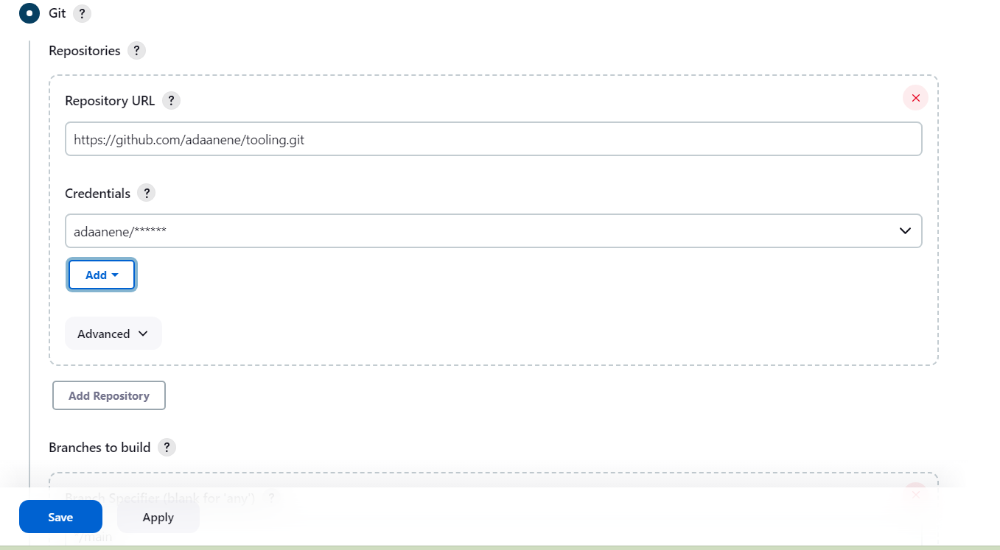
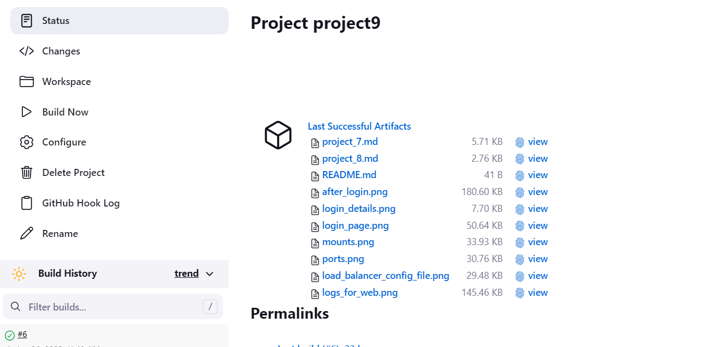
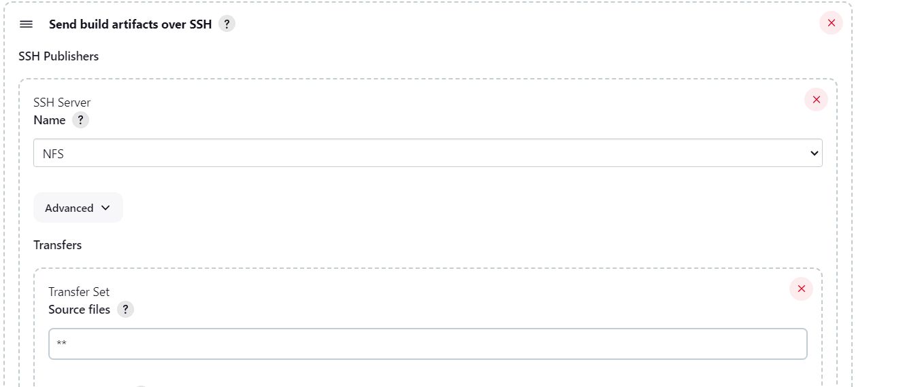
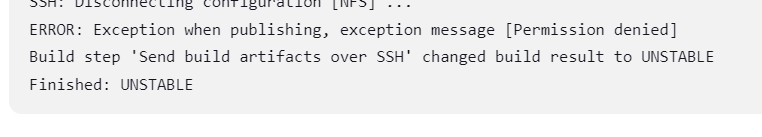

# CONTINUOUS INTEGRATION PIPELINE FOR TOOLING WEBSITE

Scope: to automate continuous integration (CI) with Jenkins. To configure a job to automatically deploy source codes changes from Git to NFS server.

## INSTALL AND CONFIGURE JENKINS SERVER

1. Spin up an EC2 instance of Ubuntu server and name it 'Jenkins'

2. Install the Java Development Kit (JDK) to work with Jenkins 

    ```
    sudo apt update
    sudo apt install default-jdk-headless
    ```

3. Install Linux repository signing keys for Jenkins 

    ```
    curl -fsSL https://pkg.jenkins.io/debian-stable/jenkins.io-2023.key | sudo tee \
        /usr/share/keyrings/jenkins-keyring.asc > /dev/null
    echo deb [signed-by=/usr/share/keyrings/jenkins-keyring.asc] \
        https://pkg.jenkins.io/debian-stable binary/ | sudo tee \
        /etc/apt/sources.list.d/jenkins.list > /dev/null    
    ```

    If this step is not completed you will get an error when trying to install Jenkins

    

4. Install Jenkins

    ```
    wget -q -O - https://pkg.jenkins.io/debian-stable/jenkins.io.key | sudo apt-key add -
    sudo sh -c 'echo deb https://pkg.jenkins.io/debian-stable binary/ > \
        /etc/apt/sources.list.d/jenkins.list'
    sudo apt update
    sudo apt-get install jenkins

    #check that Jenkins is running
    sudo systemctl status jenkins
    ```

5. The default Jenkins installation runs on port 8080 so open it in the security groups of your Jenkins server

6. Access the Jenkins setup page from your browser:

    `http://<Jenkins-Server-Public-IP-Address-or-Public-DNS-Name>:8080`

    

    - You can find the admin password by running `sudo cat /var/lib/jenkins/secrets/initialAdminPassword` in your terminal

    - In the next page, select 'install suggested plugins'

    - Next create an admin user and you will be provided with your Jenkins server address. You are now ready to start using Jenkins.


## CONFIGURE JENKINS TO RETRIEVE GITHUB SOURCE CODES USING WEBHOOKS

1. Go to your GitHub settings page and enable webhooks

    

2. Create a new freestyle project in Jenkins web console, you can name it 'tooling_github'

3. Configure the new freestyle project:

    - click on "configure" then under "Source code management" select "Git"

    - enter your Tooling GitHub repository URL and add the credentials for your GitHub account

        

    - under "branches to build" change the branch specifier to ` */main ` then save your configuration

4. Click on "build now" to test your build - if everything was done correctly you will see in the Build history section the build under `#1` with a green tick next to it

5. Now to use webhooks go back to the freestyle job configuration page and add the following:

    - under "Build triggers" select `GitHub hook trigger for GTScm polling`

    - under "Post build actions" add the action to `Archive the artifacts` (which are the files resulted from a build)
    
         Enter `**` to archive all files and save the configuration

        

6. Now if you change any file within your GitHub repository and push to the main branch, webhook will automatically begin a new job and save the job artifacts locally on Jenkins server

    

    Artifacts are stored in `/var/lib/jenkins/jobs/<job_name>/builds/<build_number>/archive/` in the Jenkins server


## CONFIGURE JENKINS TO COPY FILES TO NFS SERVER VIA SSH

1. On the Jenkins web console go to dashboard and click on "Manage Jenkins", then "Plugins".

    Select "Available plugins" and search for the `Publish Over SSH` plugin and install it without restart

2. Go back to "Manage Jenkins" menu and click on "System"

3. Set up a configuration for the job to copy artifacts to  NFS server.

    Scroll down to the "Publish over SSH" section and configure it to connect to the NFS server.

    Enter the following: 
    - the content of the private key for your NFS server
    - a name for the configuration
    - a hostname (SSH hostname or IP address to connect to)
    - a username (the username to connect with - in this case `ec2-user` since the NFS server runs on RHEL8)
    - a remote directory: `/mnt/apps` on NFS server, since this directory is mount point for the web servers to fetch files from the NFS server

4. Click on "Test configuration" and ensure it is successful, then save it. For this to work TCP port 22 must be open on the NFS server so it can receive SSH connections

5. Go to the freestyle job configuration page and add post-build action to "Send build artifacts over SSH"

    Enter the name for the SSH configuration in step 3 and `**` to transfer all files then save

    

6. Now test the configuration - change a file in README.md (or any file) in your GitHub repository and commit.

    A new job will be started by webhook and once successful the console output of the job will show something like this

    


    If you get a "permission denied" error message in console output, then you may have to change permissions for `/mnt/apps`

    


    ```
    # change permissions 

    sudo chown nobody:nobody /mnt/apps
    sudo chmod 777 /mnt/apps
    ```

7. Open NFS server in your terminal and check that the same file has been updated in `/mnt/apps` 

    `cat /mnt/apps/README.md`

    If you see the changes you made then everything works perfectly.

